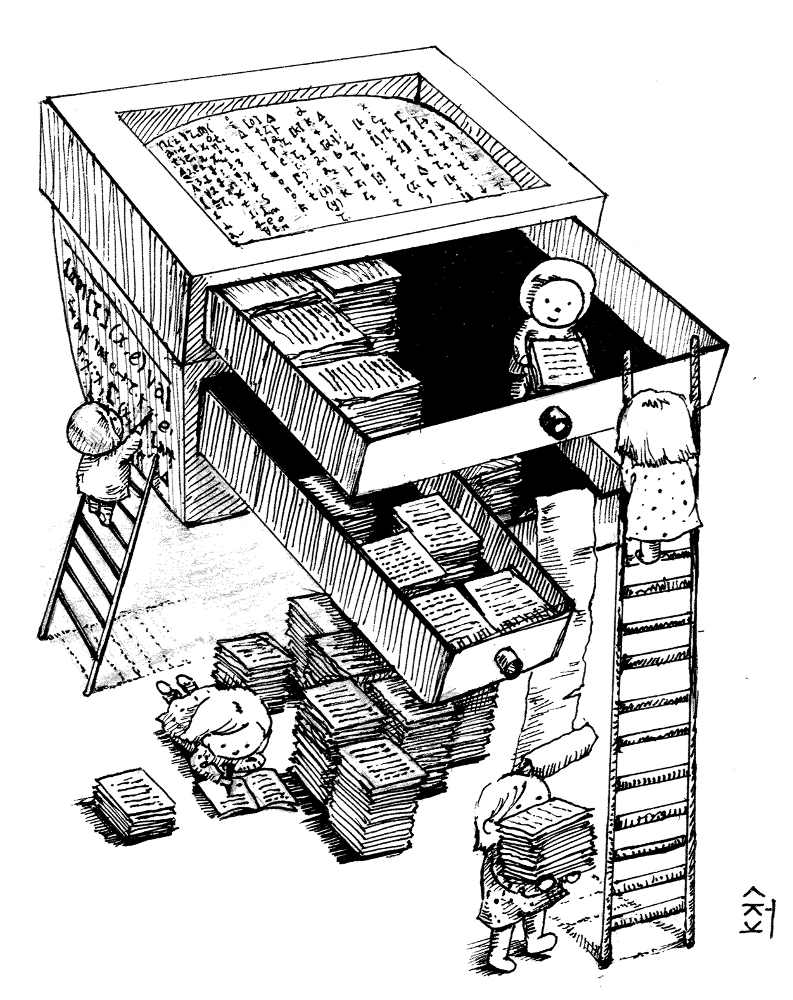
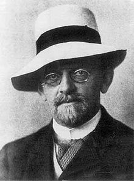
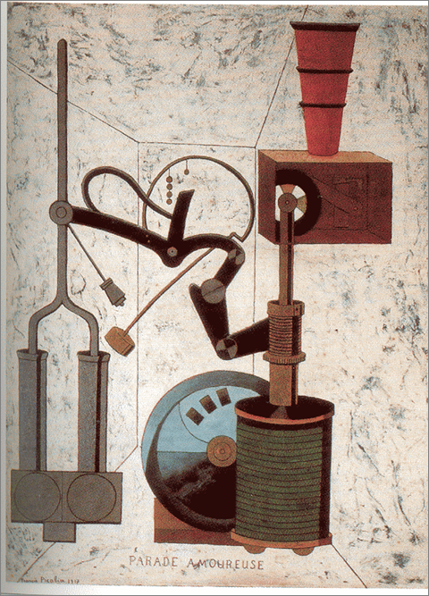
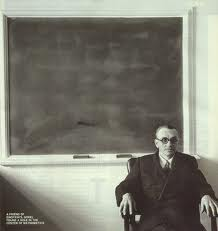
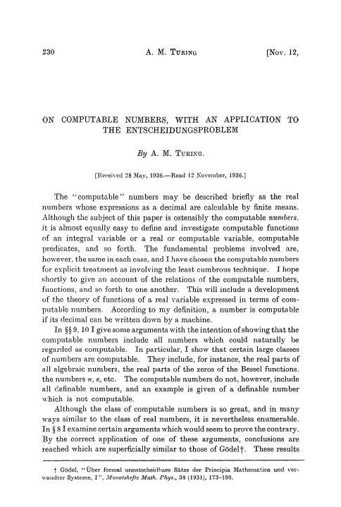
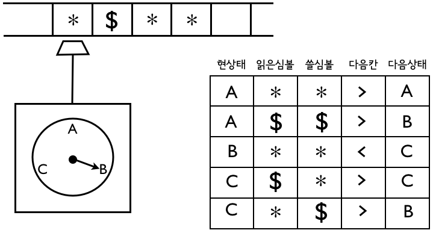
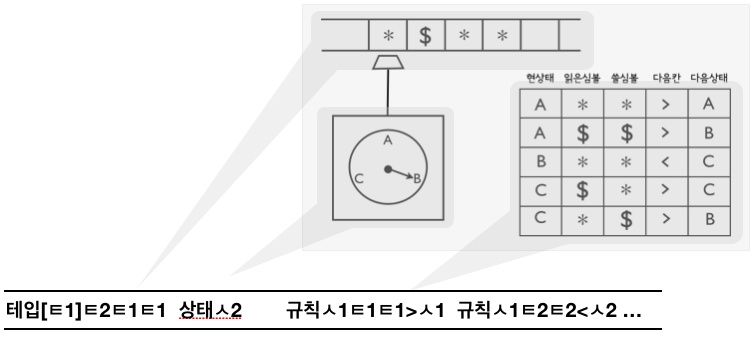

## 컴퓨터라는 도구
* 인류역사에 유례가 없던 도구
* 컴퓨터의 **놀라운 점**은 뭘까?
    * 컴퓨터 vs. 칼, 활, 바퀴, 고무밴드, 자동차, 냉장고, ···
    * 컴퓨터 = “**만능**”

## 도구 사용법
* 컴퓨터 = “**마음의 도구**”

    |         컴퓨터 | 다른 도구   |
    |---------------:|:------------|
    |     **글쓰기** | 힘쓰기      |
    | **마음, 지혜** | 팔다리 근육 |

## 컴퓨터, 마음의 도구, 만능 기계

## 컴퓨터 원천 설계도 “탄생비화”
> “만능의 도구”

* 20세기 수학의 **좌절**을 재확인하는 데 동원된 **소품**
* 이것이 20-21세기 정보혁명의 **주인공**이 되는 **아이러니**

## 수학자들의 꿈
수리명제 자동판결 문제~*entscheidungsproblem*~\
1928년 @ 국제 수학자대회(ICM)

힐베르트(Hilbert)(-1943)
> 모든 사실을 “**기계적**”으로 만들 수 있을 것 같다?

(자연수에 대한 단순~*first-order*~ 사실들을)

## “기계적”
* 생각없이 할 수 있는
* 단순작업으로 되는
* 자동으로 동작하는

## 1931년, 수학계의 “좌절” 혹은 “희소식”

괴델(Gödel)(-1978)
> “**기계적인 방식**으론 모든 사실을 만들 수 없다.”

## 튜링소년이 자신만의 방식으로 다시 한 번 증명
* 튜링의 증명속 소품으로 등장 = 컴퓨터의 원천설계도

*"계산가능한 수에 대해서, 수리명제 자동판별 문제에 응용하면서”*\
*“On Computable Numbers, with an Application to the Entscheitungsproblem” Proceedings of the London Mathematical Society, ser.2, vol.42 (1936-37). pp.230-265; corrections, Ibid, vol 43(1937) pp.544-546*

## 튜링의 1936년 논문
> [설득] 기계적으로는 모든 참인 명제를 만들 수 없다.

1. **과감히 정의: “기계적”을 정의**
2. 그리고 보임: 기계적인 작업의 한계

## 튜링의 정의: “기계적”이란 ...
> “기계적” = 튜링기계(TM)로 돌아가는 정해진 **네 가지 부품(테잎 박스, 기계 상태, 심볼 박스, 규칙표 박스)**만으로 만든 기계로 돌리는 ...

튜링기계의 한 예:

## 튜링기계 하나 = 기계작업 하나
더하기 튜링기계, 카톡 튜링기계, 유튜브 튜링기계, 등등

## 소품으로 등장한 특이한 튜링기계 하나
만능 튜링기계~*universal\ machine*~\
하나의 튜링기계, 그러나 “만능”
* 입력: 튜링기계를 글로 표현해서 테잎에 받는다
* 출력: 그 튜링기계의 작동을 그대로 따라한다

## 컴퓨터 = 만능 튜링기계~*universal\ machine*~
* 사용법: 임의의 튜링기계(**소프트웨어**) 테잎에 싣기
* 자동작동: 테잎에 있는 튜링기계 그대로 따라하기(**실행**)

## 튜링의 1936 논문
> [설득] 기계적으로는 모든 참인 명제를 만들 수 없다.

1. 과감히 정의: “기계적”을 정의
2. **그리고 보임: 기계적인 작업의 한계**

## 튜링 증명의 지렛대: 만능기계 & “셀 수 있음”
* 어떤 튜링기계건 **정해진 유한개 부호**의 글로 표현가능

* 39개 부호 = 한글 24개 자모, 아라비아 숫자 10개, \<, \>, \|\|, \[, \]
* 그런 글 = 39-진법의 자연수

## 튜링의 증명
* 사실1: *VERI* 가능하면 *H* 가능 ($\color{teal}{\exists VERI \Rightarrow \exists H}$)
    * 참인 명제를 모두 술술 만드는 튜링기계(*VERI*)가 존재한다면, 그 기계로 **멈춤문제**를 풀 수 있다(*H*).

* 사실2: *H* 불가능 ($\color{teal}{\nexists H}$)
    * **멈춤문제**를 푸는 튜링기계는 존재할 수 없다.

따라서, 기계적으로는 모든 참인 명제를 만들 수 없다.

## 사실 1: $\exists VERI \Rightarrow \exists H$
만일 모든 참인 명제를 만드는 튜링기계(*VERI*)가 존재한다면, 그 기계로 **멈춤문제**를 푸는 기계(*H*)를 만들 수 있다. 왜?\
기계 *H*를 다음과 같이 만들 수 있다.

1. 기계를 입력받는다 (*M* 이라고 하자)
2. 만능기계로 *VERI* 를 실행시킨다
3. *VERI*는 모든 참인 명제를 만들므로, 언젠가는 “*M*은 멈춘다” 또는 “*M*은 멈추지 않는다”를 만들 것이다
4. 만드는 데로 답하면 된다

이므로.
## 사실 2: $\nexists H$
자연수로 모든 튜링기계와 입력을 번호매길 수 있다: *M~1~*, *M~2~*, ···, *I~1~*, *I~2~*, ···.

1. **만약 *H*를 만들 수 있으면**, 다음 테이블을 모두 메꿀 수 있다.

$$
  \begin{array}{r|lll}
    \ & I_1 & I_2 & ··· \\
    \hline
    M_1 & 1 & 1 & ··· \\
    M_2 & 1 & 0 & ··· \\
    ··· & ··· & ··· & 
  \end{array}
$$

2. 그러면 **모든 튜링기계와 다른 튜링기계** *X*를 만들 수 있다!
    *X* = 입력 *I~n~* 마다 *M~n~* 과 다르게 작동하도록(대각선논법)\
      = *Table(M~n~ , I~n~)* = 1 이면 *M~n~* 돌린결과+1 아니면 1

3. *M~1~*, *M~2~*, ··· 가 다가 아니고 *X* 가 또 있다고? 말이 안 되네.
그러네, *H* 는 있어서는 안 되네.

## 튜링의 증명: 사실1 + 사실2. 끝
* 사실1: *VERI* 가능하면 *H* 가능 ($\color{teal}{\exists VERI \Rightarrow \exists H}$)
    * 참인 명제를 모두 술술 만드는 튜링기계(*VERI*)가 존재한다면, 그 기계로 **멈춤문제**를 풀 수 있다(*H*).
    * *VERI*: 힐베르트 교수가 찾고자 했던 기계 (참인 명제들을 하나도 빠뜨리지 않고 만들어내는 기계)
    * *H(Halting problem)*: 글로 표현된 튜링기계를 돌렸을 때, 영원히 돌 것인가, 어느 순간에 멈출 것인가를 정확히 답할 수 있는 기계

* 사실2: *H* 불가능 ($\color{teal}{\nexists H}$)
    * **멈춤문제**를 푸는 튜링기계는 존재할 수 없다.

따라서, 기계적으로는 모든 참인 명제를 만들 수 없다.

## 기억: 튜링 증명(1935년 논문)의 5개 아이디어들
1. **튜링기계**
2. 튜링기계를 **글로 표현**하기
3. 글로 입력된 튜링기계를 돌리는 **만능 튜링기계**(컴퓨터)
4. 글로 입력된 튜링기계가 **끝날지 미리 판단하는 문제**
5. **대각선논법**: “그것 말고 더 있어요” 설득기술

*** 

* References: 
    * 이광근. (2018). *컴퓨터과학의 원천 아이디어가 나오기까지* [video file]. Retrieved November 13, 2019, from [http://ikaos.org/ko/video/video01.html?kb_idx=1559&mode=view](http://ikaos.org/ko/video/video01.html?kb_idx=1559&mode=view).
    * 이광근. (2019). *컴퓨터과학의 원천 아이디어가 나오기까지: 튜링의 1935년 이야기* [PowerPoint slides]. Retrieved November 13, 2019, from [http://kwangkeunyi.snu.ac.kr/talk/kaos18.pdf](http://kwangkeunyi.snu.ac.kr/talk/kaos18.pdf).
