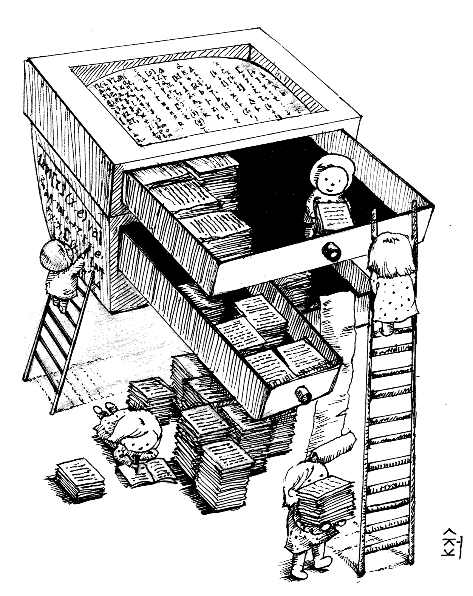
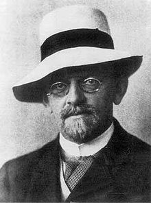
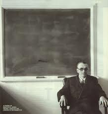
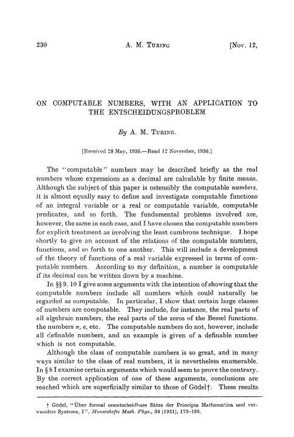
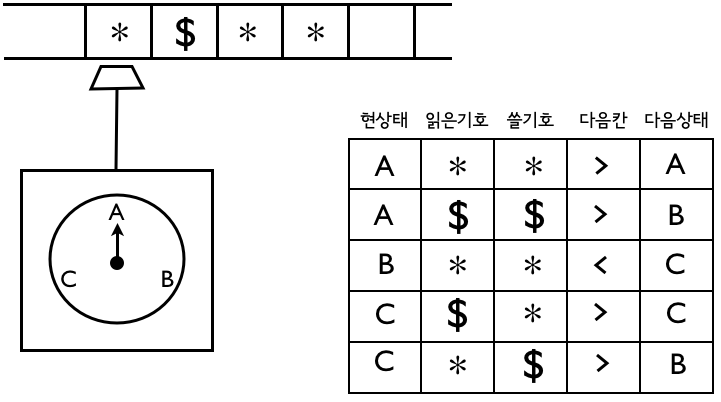
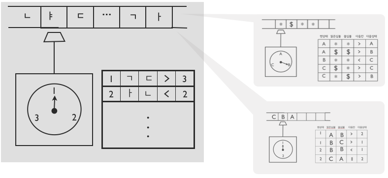
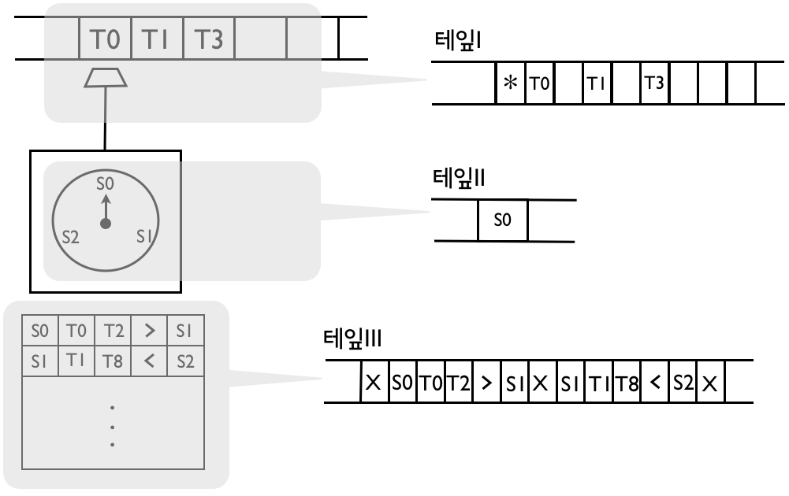
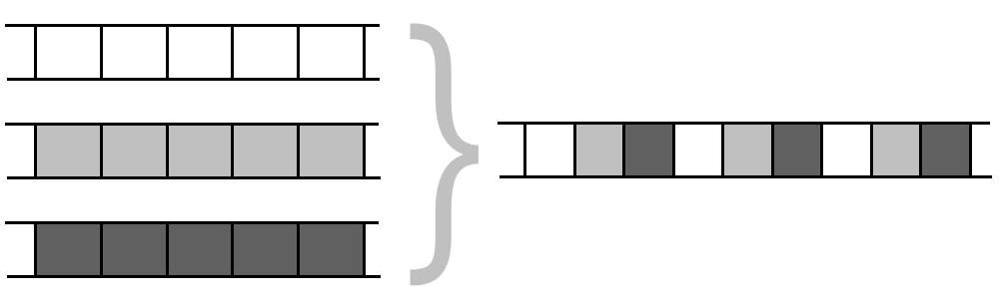
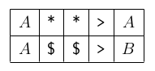

## 컴퓨터라는 도구
* 인류역사에 유례가 없던 도구
* 컴퓨터의 **놀라운 점**은 뭘까?
    * 컴퓨터 vs. 칼, 활, 바퀴, 고무밴드, 자동차, 냉장고, ···
    * 컴퓨터 = “**만능**”

* 도구 사용법
    * 컴퓨터 = “**마음의 도구**”

    |         컴퓨터 | 다른 도구   |
    |---------------:|:------------|
    |     **글쓰기** | 힘쓰기      |
    | **마음, 지혜** | 팔다리 근육 |

* 컴퓨터, 마음의 도구, 만능 기계

## 컴퓨터 원천 설계도 “탄생비화”
> “보편만능의 도구(universal machine)”

* 20세기 수학의 **좌절**을 재확인하는 데 동원된 **소품**
* 이것이 20-21세기 정보혁명의 **주인공**이 되는 **아이러니**

## 수학자들의 꿈
수리명제 자동판결 문제(~*Entscheidungsproblem,\ decision\ problem*~)\
1928년 @ 국제 수학자대회(ICM)

David Hilbert(-1943)
> 모든 명제들의 첨/거짓을 “**기계적**”으로 판명할 수 없을까?

> 참인 모든 명제들을 “**기계적**”으로 만들어낼 수 없을까?

(자연수에 대한 단순~*first-order*~ 사실들을)

## “기계적”
* 생각없이 할 수 있는
* 단순작업으로 되는
* 자동으로 동작하는

## 1931년, 수학계의 “좌절” 혹은 “희소식”

Kurt Gödel(-1978)
> “**기계적인 방식**만으론 사실인지 판정할 수 없는, 그런 명제가 존재한다."

* 튜링소년이 자신만의 방식으로 다시 한 번 증명
    * 튜링의 증명속 소품으로 등장 = 컴퓨터의 원천설계도

*"계산가능한 수에 대해서, 수리명제 자동판별 문제에 응용하면서”*\
*“On Computable Numbers, with an Application to the Entscheitungsproblem” Proceedings of the London Mathematical Society, ser.2, vol.42 (1936-37). pp.230-265; corrections, Ibid, vol 43(1937) pp.544-546*

* 1934년 11월, Cambridge U 학부졸업논문 제출
* 1935년 봄, Part III course on Foundations of Mathematics 수강(강사: Max Newman)
* Newman의 강의는 Gödel의 불완전성의 증명(Incompleteness Theorem)으로 마무리됨
    * "QQ기계적인 방식WW으로는 참/거짓을 판명할 수 없는 명제가 존재한다."
    * Newman: "참/거짓을 판명해주는 QQ기계적인 방식WW은 있을 수 있겠지 ..."
* Newman 강의를 수강 후 1935년 초여름, 
    * 1935년 4월 말, group theory에 대한 논문 제출 및 출반(London Mathematical Society). 이 논문은 폰 노이만 논문을 작게 개선한 것.
    * 1935년 양자역학 연구를 할까 생각하며 수리물리학 Fowler 교수를 찾아가 연구꺼리를 얻었으나 진전이 없었음
    * Newman이 강의 때 던진 말이 튜링의 관심을 붙듦
* 이때 즈음, 장거리 달리기 취미를 가진 튜링 왈, "달리기를 마치고 풀밭에 누워 있는데 힐버트의 세 번째 문제를 어떻게 풀지가 생각나더라."

## 튜링의 1936년 논문
> [설득] 기계적으로는 모든 참인 명제를 만들 수 없다.

1. **과감히 정의: “기계적”을 정의**
2. 그리고 보임: 기계적인 작업의 한계

## 튜링의 정의: “기계적”이란 ...
> “기계적” = 튜링기계(TM)로 돌아가는 정해진 **네 가지 부품(테잎 박스, 기계 상태, 심볼 박스, 규칙표 박스)**만으로 만든 기계로 돌리는 ...
* 무한: 빈칸이 무한히 많은 테잎
* 유한: 기계상태들 $\Bbb R \subseteq \Bbb S \times \Bbb T \times \Bbb T \times \{ \gt, \lt, \Arrowvert \} \times \Bbb S$

튜링기계의 한 예:

## 튜링기계 하나 = 기계작업 하나
더하기 튜링기계, 카톡 튜링기계, 유튜브 튜링기계, 등등

## 소품으로 등장한 특이한 튜링기계 하나
만능 튜링기계~*universal\ machine*~\
하나의 튜링기계, 그러나 “만능”
* 입력: 튜링기계를 글로 표현해서 테잎에 받는다
* 출력: 그 튜링기계의 작동을 그대로 따라한다

## 컴퓨터 = 만능 튜링기계~*universal\ machine*~
* 사용법: 임의의 튜링기계(**소프트웨어**) 테잎에 싣기
* 자동작동: 테잎에 있는 튜링기계 그대로 따라하기(**실행**)

* 아래 과정을 반복함
1. 읽기: 테잎II에서 현재상태 심볼 S~*i*~
2. 읽기: 테잎I에서 위치심볼(\*)의 테잎심볼 T~*j*~
3. 규칙찾기: S~*i*~와 T~*j*~가 매치되는 규칙을 테잎 III에서 찾기
4. 찾은 규칙이 시키는 일 하기: 심볼 복사 + 위치 심볼 이동

## 튜링의 1936 논문
> [설득] 기계적으로는 모든 참인 명제를 만들 수 없다.

1. 과감히 정의: “기계적”을 정의
2. **그리고 보임: 기계적인 작업의 한계**

## 튜링 증명의 지렛대: 만능기계 & “셀 수 있음”
* 어떤 튜링기계건 **정해진 유한개 부호**의 글로 표현가능

* 상태 심볼 {*A*, *B*, *C*}는 {***S~0~***, ***S~1~***, ***S~2~***}
* 테이프 심볼 {***, *\$*}는 {***T~0~***, ***T~1~***}
* 따라서 일렬로 표현하면
    * *A*  ***  ***  *>* *A*   끝 *A*  *\$*  *\$*  *>* *B*
    * *S0* *T0* *T0* *>* *S0*  X  *S0* *T1* *T1* *>* *S1*

* 즉, ***S, T, 0, ..., 9, <, >, ||, X***로 표현한 16진수
    * marker 더하면 17진수
        * 테잎 한 칸이 두 개의 저장 공간을 갖고 있다고 생각해 보라
        * 한 쪽엔 위치 정보를 기록하는 marker(*)를 기록하고, 다른 한 쪽엔 정보를 저장

* 세 개의 테잎을 각각 자연수 N~1~, N~2~, N~3~으로 나타내면, 소인수분해 개념을 이용해 하나의 자연수로 만들 수 있음
    * 2^N~1~^ X 3^N~2~^ X 5^N~3~^
    

## 튜링의 증명
* 사실1: *VERI* 가능하면 *H* 가능 ($\color{teal}{\exists VERI \Rightarrow \exists H}$)
    * 참인 명제를 모두 술술 만드는 튜링기계(*VERI*)가 존재한다면, 그 기계로 **멈춤문제**를 풀 수 있다(*H*).

* 사실2: *H* 불가능 ($\color{teal}{\nexists H}$)
    * **멈춤문제**를 푸는 튜링기계는 존재할 수 없다.

따라서, 기계적으로는 모든 참인 명제를 만들 수 없다.

## 증명 준비
* 튜링기계의 개수는 무한히 많지만, 자연수의 개수를 넘을 수 없다. 
    * 튜링기계마다 자연수 하나(17진수의 자연수)에 대응
* 무한의 세계에도 크기 차이가 있다. 
    * **칸트로(Georg Cantor)의 대각선 논법**   
($| \Bbb N | \lt | 2^{\Bbb N} |$)

## 사실 1: $\exists VERI \Rightarrow \exists H$
만일 모든 참인 명제를 만드는 튜링기계(*VERI*)가 존재한다면, 그 기계로 **멈춤문제**를 푸는 기계(*H*)를 만들 수 있다. 왜?\
기계 *H*를 다음과 같이 만들 수 있다.

1. 기계를 입력받는다 (*M* 이라고 하자)
2. 만능기계로 *VERI* 를 실행시킨다
3. *VERI*는 모든 참인 명제를 만들므로, 언젠가는 “*M*은 멈춘다” 또는 “*M*은 멈추지 않는다”를 만들 것이다
4. 만드는 데로 답하면 된다

이므로.
## 사실 2: $\nexists H$
자연수로 모든 튜링기계와 입력을 번호매길 수 있다: *M~1~*, *M~2~*, ···, *I~1~*, *I~2~*, ···.

1. **만약 *H*를 만들 수 있으면**, 다음 테이블을 모두 메꿀 수 있다.

$$
  \begin{array}{r|lll}
    \ & I_1 & I_2 & ··· \\
    \hline
    M_1 & 1 & 1 & ··· \\
    M_2 & 1 & 0 & ··· \\
    ··· & ··· & ··· & 
  \end{array}
$$

2. 그러면 **모든 튜링기계와 다른 튜링기계** *X*를 만들 수 있다!
    *X* = 입력 *I~n~* 마다 *M~n~* 과 다르게 작동하도록(대각선논법)\
      = *Table(M~n~ , I~n~)* = 1 이면 *M~n~* 돌린결과+1 아니면 1

*X(n) = UM(M~n~, I~n~) X H(M~n~, I~n~) + 1*

3. *M~1~*, *M~2~*, ··· 가 다가 아니고 *X* 가 또 있다고? 말이 안 되네.
그러네, *H* 는 있어서는 안 되네.

## 튜링의 증명: 사실1 + 사실2. 끝
* 사실1: *VERI* 가능하면 *H* 가능 ($\color{teal}{\exists VERI \Rightarrow \exists H}$)
    * 참인 명제를 모두 술술 만드는 튜링기계(*VERI*)가 존재한다면, 그 기계로 **멈춤문제**를 풀 수 있다(*H*).
    * *VERI*: 힐베르트 교수가 찾고자 했던 기계 (참인 명제들을 하나도 빠뜨리지 않고 만들어내는 기계)
    * *H(Halting problem)*: 글로 표현된 튜링기계를 돌렸을 때, 영원히 돌 것인가, 어느 순간에 멈출 것인가를 정확히 답할 수 있는 기계

* 사실2: *H* 불가능 ($\color{teal}{\nexists H}$)
    * **멈춤문제**를 푸는 튜링기계는 존재할 수 없다.

따라서, 기계적으로는 모든 참인 명제를 만들 수 없다.

## 기억: 튜링 증명(1935년 논문)의 5개 아이디어들
1. **튜링기계**
2. 튜링기계를 **글로 표현**하기
3. 글로 입력된 튜링기계를 돌리는 **만능 튜링기계**(컴퓨터)
4. 글로 입력된 튜링기계가 **끝날지 미리 판단하는 문제**
5. **대각선논법**: “그것 말고 더 있어요” 설득기술

*** 

* References: 
    * 이광근. (2015). *컴퓨터과학이 여는 세계*. 인사이트.
    * 이광근. (2016). *SNUON_컴퓨터과학이 여는 세계* [video file]. Retrieved May 27, 2018, from [https://www.youtube.com/watch?v=HTWSPoDLmHI&list=PL0Nf1KJu6Ui7yoc9RQ2TiiYL9Z0MKoggH](https://www.youtube.com/watch?v=HTWSPoDLmHI&list=PL0Nf1KJu6Ui7yoc9RQ2TiiYL9Z0MKoggH).
    * 이광근. (2016). *SNU 046.016 컴퓨터과학이 여는 세계(Computational Civilization) Part I* [PowerPoint slides]. Retrieved May 27, 2018, from [http://ropas.snu.ac.kr/~kwang/046.016/15/1h4in1.pdf](http://ropas.snu.ac.kr/~kwang/046.016/15/1h4in1.pdf).
