## Abstraction hierarchy
* 간단했던 “기계적인 계산”의 실체 (튜링기계)
* 그 실현 또한 간단한 것들로 차곡차곡 쌓아올려짐 (hierarchy)
    * 모든 부품을 **디지털 논리회로**로 구현 가능
    * 모든 디지털 논리회로는 **AND, OR, NOT**으로 구성
    * AND, OR, NOT은 **스위치**들로 구현 가능
    * 모든 스위치는 **직렬, 병렬, 뒤집기**로 구성
    * 스위치는 어떤 **흐름을 제어**
    * 흐르는 실체는 전기/물/빛/힘 등이며, 0 혹은 1을 뜻하는 신호를 전달

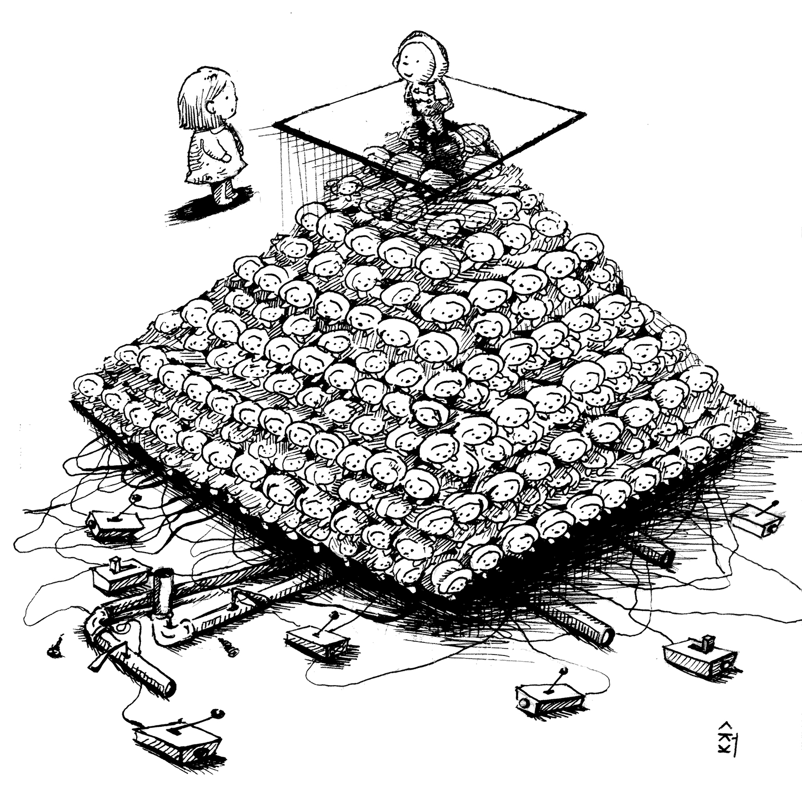

## 부울(George Boole)
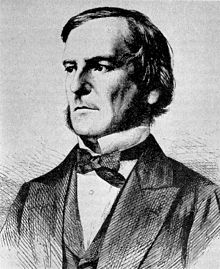

George Boole(1815 - 1864)

* 생각의 법칙에 대한 탐구
    * *An Investigation of the Laws of Thought*, 1854
        * Boolean Logic 
        * Boolean Algebra
        
        * 생각은 조립식
        * 세 가지 조립방법: AND, OR, NOT

* 부울대수/부울논리(Boolean Algebra/Boolean Logic)
    * 참(1)과 거짓(0)에 대한 "대수"

$$
  \begin{aligned} 
    A + (B + C) &= (A + B) + C  \\ 
    A + B &= B + A              \\ 
    A(B + C) &= (AB) + (AC)     \\ 
    A1 &= A                     \\ 
    AA &= A                     \\ 
    A(A + B) &= A               \\ 
    A0 &= A                     \\ 
    A(-A) &= 0                  \\ 
    (-A) + (-B) &= -(AB)        \\ 
    -(-A) &= A                  \\ 
                                \\ 
    A(BC) &= (AB)C              \\ 
    AB &= BA                    \\ 
    A + (BC) &= (A + B)(A + C)  \\ 
    A + 0 &= A                  \\ 
    A + A &= A                  \\ 
    A + (AB) &= A               \\ 
    A + 1 &= 1                  \\ 
    A + (-A) &= 1               \\ 
    (-A)(-B) &= -(A + B)
  \end{aligned}
$$

## 스위치 회로
* 0과 1을 가지고 노는 회로

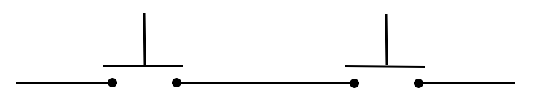

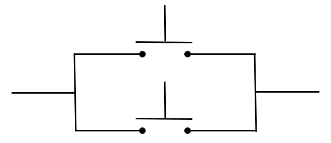

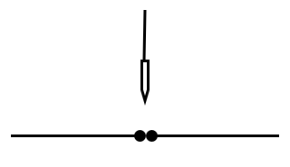

* 여러 자연현상으로 구현 가능
    * 전기와 전기줄
    * 물과 수도관
    * 힘과 막대
    * ...

## 스위치 회로 = 부울 논리(Boolean Logic)
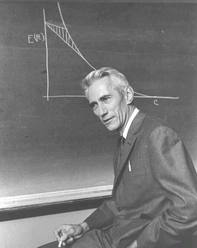

Claude Shannon(1916 - 2001)

* *A Symbolic Analysis of Relay and Switching Circuits*, 1937, MIT 석사 논문
    * 발견
        * 스위치 회로는 부울 논리(Boolean logic)을 따름
        * 디지털 논리(digital logic)회로
        * "역사상 가장 영향력있는 석사논문"
    * Information Theory 창시자
        * *A Mathematical Theory of Communication*, Bell System Technical Journal 27(3):379-423, 1948, Bell Labs
        * “Margna Carta of information age”

## 디지털 논리회로도
* 텍스트
    * 문법: $C := x \mid \overline C \mid C+C \mid CC \mid (C)$
    * 예: $x + (yz + z)$

* 그림
    * 문법: 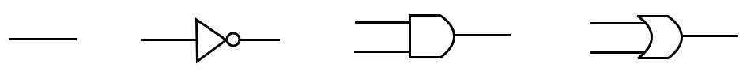

    * 예: 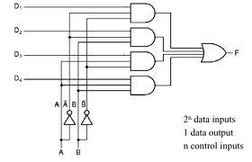

## 디지털 논리회로 만들기: 제어(control)
* 모두 스위치 회로로 구현 가능
    * 함축
        * A implies B simply means "if A is true, then B must be true".
        * A가 틀리면, 해당 명제는 참이다. (Boolean Logic)
            * 내가 너를 사랑하지 **않는게 아니다**. (현실) 
    * 두개가 같은지 다른지 판단하기
        * 벤 다이어그램 또는 진리표
    * 가위바위보 누가이겼나 판단하기
        * 두 명의 경우의 수 (9 가지)와 결과 (3 가지)
    * 둘중하나 결정하기 (“multiplexer”)
    * 번호부르면 응답하기 (“decoder”)

    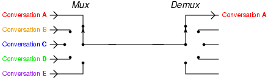

## 디지털 논리회로 만들기: 메모리(memory)
* 기억하고 있기 (“flip-flop”)
    * 스위치회로 발명: 1918, William Eccles and Frank Jordan

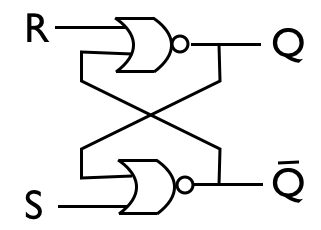

* R=0, S=1 이면 Q=1 (1 쓰기)
* R=0, S=0 이면 Q=1 (기억하고있기)
* R=1, S=0 이면 Q=0 (0 쓰기)
* R=0, S=0 이면 Q=0 (기억하고있기)

* CPU의 레지스터는 AND, OR, NOT 게이트로 메모리 구현
    * 집약도는 낮지만, 속도가 빠름
* RAM은 다른 메모리 소자로 구현됨
    * 집약도는 높지만, 속도가 느림
    * D(Dynamic)RAM
        * 한 번 사용하면 (값을 읽으면) 다시 충전
        * 물통과 수도벨브 연상(한 번 사용하면 다시 충전해야 함)
    

# 디지털 논리회로 만들기: 유한상태기계
* “Finite State Machine”: 유한개의 상태 + 입/출력.

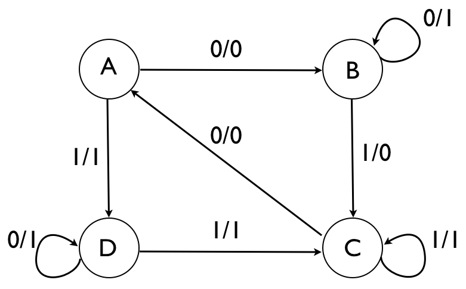

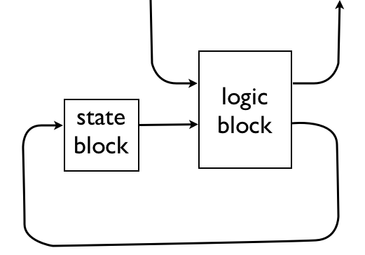

* 매번, 입력받고 출력내놓기
* 입력 = (현재 상태, 입력값)
* 출력 = (다음 상태, 출력값)
* 현재 상태 = 지난번의 다음 상태. **기억필요**

    | 입력 | 출력 |
    |:----:|:----:|
    | A 0  | 0 B  |
    | A 1  | 1 D  |
    | B 0  | 1 B  |
    | B 1  | 0 C  |
    | C 0  | 0 A  |
    | C 1  | 1 C  |
    | D 0  | 1 D  |
    | D 1  | 1 C  |

    * 인코딩: A(00), B(01), C(10), D(11)
    * “state block”: 두개의 flip-flop으로 기억

## 컴퓨터 구현의 원리
* 속내용을 감추며 차곡차곡 쌓기~*abstraction\ hierarchy*~
    * 속내용 감추기~*abstraction*~
        * 감추기: 어떻게 만든것인지는
        * 알리기: 어떻게 사용하는지만
        * 부품의 속내용 감추기
    * 차곡차곡 쌓기~*hierarchy*~
        * 속내용 감추기가 모든 계층에서 준비됨
        * 각 단계에서 바로 아래 단계의 물건들만 사용
        * 최종적인 목표물이 제일 윗 단계에서 만들어짐

* 복잡한 물건을 쉽고 짜임새있게 차곡차곡 만드는 지혜

## 규칙표 장치 만들기: 유한상태기계 + 메모리

| S | R | W | D | S′|
|:-:|:-:|:-:|:-:|:-:|
| A | □ | : | > | B |
| B | □ | ) | > | A |

* 모든 심볼을 0과 1로 표현:

| 심볼   | 상태  | 움직임 |
|:------:|:-----:|:------:|
| □ → 11 | A → 0 | > → 01 |
| : → 00 | B → 1 | < → 10 |
| ) → 01 |       | ‖ → 00 |

* 규칙표 장치가 하는 일: 입력에 대한 출력

|          | 입력                 |                      ||                      |                      | 출력                 |                      |           |
|:--------:|:--------------------:|:--------------------:||:--------------------:|:--------------------:|:--------------------:|:--------------------:|:---------:|
| *S* | *I~0~* | *I~1~* || *W~0~* | *W~1~* | *D~0~* | *D~1~* | *S′* |
| 0        | 1                    | 1                    || 0                    | 0                    | 0                    | 1                    | 1         |
| 1        | 1                    | 1                    || 0                    | 1                    | 0                    | 1                    | 0         |

* “규칙표 논리회로” 구성 = 유한상태기계 + 메모리

## 메모리 장치 만들기
* 장치 구성

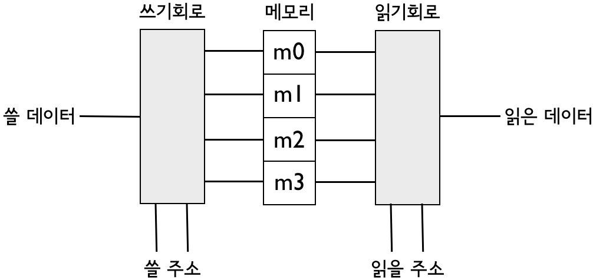

* 읽기회로와 쓰기회로
    * 응답회로는 디코더(decoder)

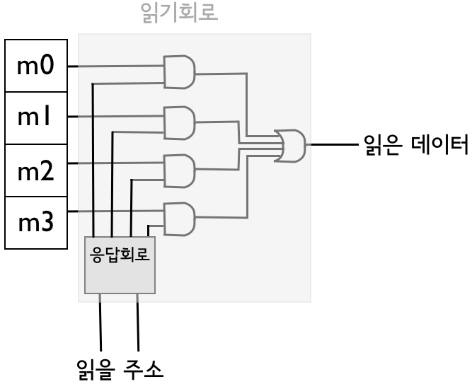

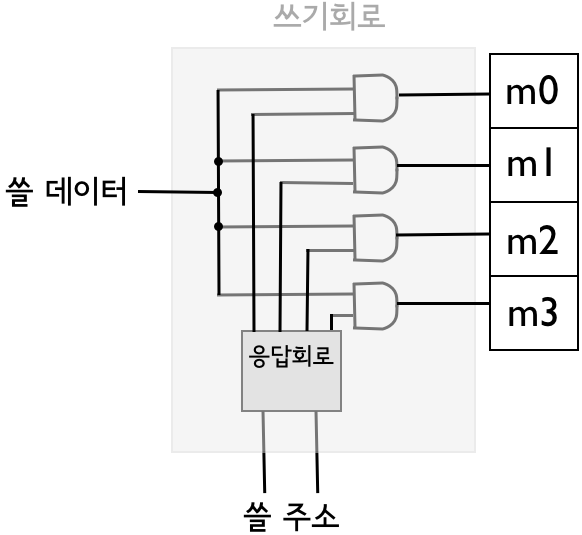

## 보편만능의 기계: von Neumann의 설계

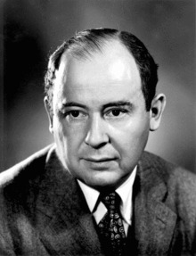

John von Neumann(1903–1957)

* *First Draft of a Report on the EDVAC(Electronic Discrete Variable Automatic Computer)*, John von Neumann, 1945
    * 이 디자인이 실제 완성된 해는 1952년
    * 튜링은 1946년에 설계(ACE, Automatic Computing Engine) 후 1950년 완성
    * 영국 멘체스터 대학에서는 같은 능력의 컴퓨터(Manchester Mark I)를 1948년에 완성
        * 맥스 뉴먼 교수가 이끄는 팀
        * ACE 실현 즈음에 튜링은 맥스 뉴먼의 팀에 합류해 멘체스터 마크 원 다음 버전을 디자인하고 구현하는 데 참여
    * 1946년 미국 펜실베이니아 대학에서 만든 ENIAC 또한 전기회로를 사용하는 범용 컴퓨터지만, 프로그램이 순수 소프트웨어 형태로 메모리에 저장되는 방식이 아닌 외부에 노출된 스위치와 전기선을 조작하는 형태(하드웨어의 재조립)

* 메모리는 주소로 직접접근
* 메모리에 싣는 프로그램: load, store, arithematic operators, jump 등 명령문들의 일렬

## 폰노이만 기계 = 튜링의 보편만능의기계

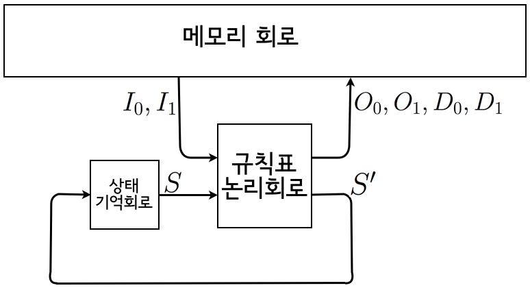

엄격한 증명은 없지만, 명백히
* 폰노이만 기계의 작동은 튜링 기계로 표현가능
* 튜링기계의 작동은 폰노이만 기계로 표현가능

(무한한 메모리만 있다면)

## 재료
* 트랜지스터의 발견
    * 클로드 섀넌이 벨랩(Bell Labs)에 있던 시절
    * 1957년 바딘(John Bardeen), 브래튼(Walter Brattain), 쇼클리(William Shockley) 노벨상 수상

## 효율
* 초창기: 불도저로 방문을 여닫는 정도
* 현재: 말 한마리가 방문응 여닫는 정도
    * 70년대 수천 개 스위치를 약 0.5 (W)로 구동 (불도저로 방문응 여닫는 수준)
    * 현재(2010 년) 10^6^ 배 많은 스위치 (10^9^ 개 정도)를 약 80 (W)로 구동할 수 있음
    * 너무 **큰** 힘으로 너무 작은 일을 하고 있음

* 컴퓨터는 반드시 스위치로 구현될 필요가 없으며, AND, OR, 그리고 NOT 역할을 할 수 있는 다른 자연현상으로 충분히 대체 가능함(양자 컴퓨터)

* 미래에는 다른 재료와 장치로 지금보다 훨씬 작고 밀도가 높으며 효율적인 컴퓨터를 구현할 수 있을 것이라 기대
    * 2014년 기준 한 사람의 뇌 안에 기능하는 스위치의 수가 전 세계 컴퓨터의 CPU가 가진 스위치를 모두 합한 것보다 많음
        * 성인 한 명의 뇌에는 약 10^18^ 개의 스위치가 있음
            * 성인 뇌 하나에 약 1000억 (100 X 10^9^) 개의 뉴런이 있음
            * 각 뉴런마다 많게는 만 개까지의 지점에서 다른 뉴런과 연결되어 있음
            * 각 연결지점(*synapse*)마다 수천 개의 스위치가 존재

        * 현대 물리학에서 우주의 나이를 초로 계산하면 10^17^ ~ 10^18^초 사이
        * 지구상의 모래 알갱이 수는 약 7.5 x 10^18^개 정도
            * 대략 7 ~ 8 명의 뇌 안에 지구상의 모든 모래알 수만큼의 스위치가 들어있음

*** 

* References: 
    * 이광근. (2015). *컴퓨터과학이 여는 세계*. 인사이트.
    * 이광근. (2016). *SNUON_컴퓨터과학이 여는 세계* [video file]. Retrieved May 27, 2018, from [https://www.youtube.com/watch?v=HTWSPoDLmHI&list=PL0Nf1KJu6Ui7yoc9RQ2TiiYL9Z0MKoggH](https://www.youtube.com/watch?v=HTWSPoDLmHI&list=PL0Nf1KJu6Ui7yoc9RQ2TiiYL9Z0MKoggH).
    * 이광근. (2016). *SNU 046.016 컴퓨터과학이 여는 세계(Computational Civilization) Part II* [PowerPoint slides]. Retrieved May 27, 2018, from [http://ropas.snu.ac.kr/~kwang/046.016/15/2h4in1.pdf](http://ropas.snu.ac.kr/~kwang/046.016/15/2h4in1.pdf).
