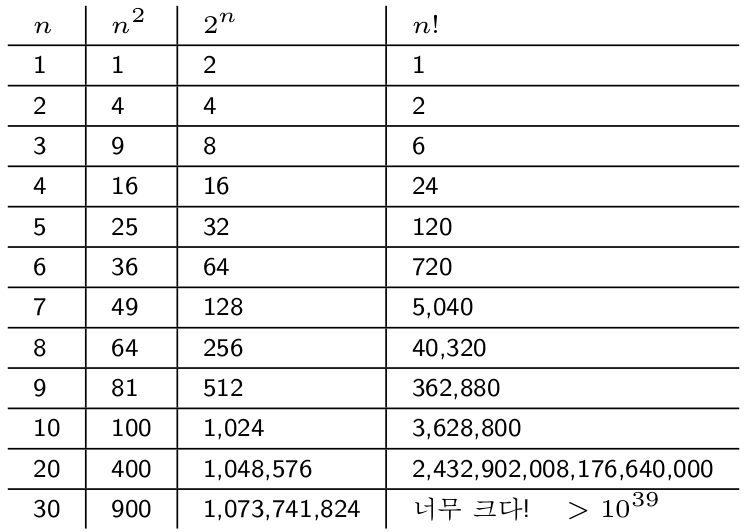
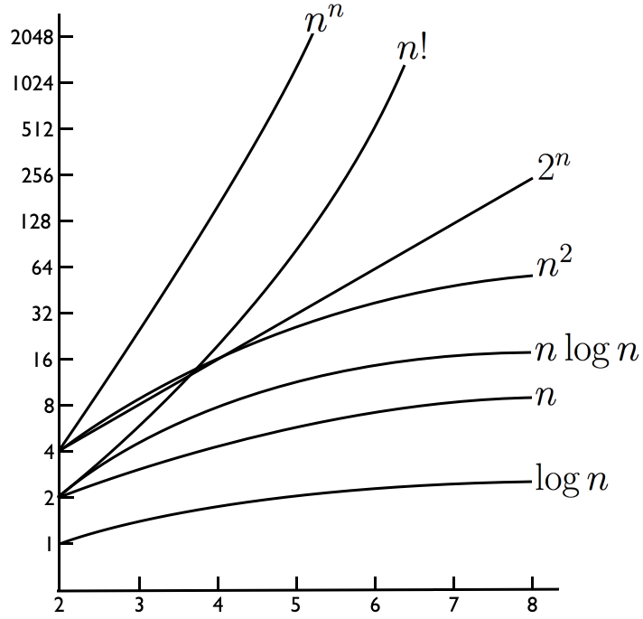

## 소프트웨어
컴퓨터(universal turing machine)라는 “마음의 도구”를 다루는 방법

* 소프트웨어(turing machine): **지혜와 언어**로 짜고 짓는
* 소프트웨어는 무섭다: **구체적인 실천** (단지 스위치들의 집합, 주어진 명령을 묵묵히 수행하는)
    * 소프트웨어는 사람이 만들고 기계가 실행함

## 소프트웨어를 잘 만들 방법

| 알고리즘(algorithm) | 언어(language) |
|--------------------:|:---------------|
| 일하는 방도         | 표현하는 방식  |
| 푸는 솜씨           | 담는 그릇      |
| 박차                | 고삐           |

## 개괄
소프트웨어는 튜링기계다. 튜링기계는 어떤 일을 하고, 그 일은 어떤 문제를 푸는 것이다. 컴퓨터는 그 소프트웨어(튜링기계)를 실행하면서 문제풀이를 자동으로 진행하는데, 이때 "컴퓨터로 문제를 푼다"는 것이 이 뜻이다. **컴퓨터로 돌릴 소프트웨어를 만드는 것이다**.

* 푸는 솜씨, **알고리즘과 복잡도**
    * 소프트웨어(튜링기계)로 만드는 문제 푸는 방도
    * 컴퓨터 문제 풀이법
    * 비용의 계층
    * 컴퓨터로 풀 수 있는 쉬운 문제와 어려운 문제의 경계

* 담는 그릇, **언어와 논리**
    * 소프트웨어(튜링기계)를 표현하는 언어
        * 튜링기계의 규칙표 방식은 매우 원시적
        * 사람에게 좀 더 편한 방식 요구
            * 쉽게 작성되고, 쉽게 검증할 수 있어야 
    * 언어의 계층. 번역과 실행
    * 프로그래밍 언어의 두개의 중력
    * 프로그래밍 = 논리증명

## 알고리즘
알고리즘은 컴퓨터로 돌릴 수 있는 문제푸는 방도
* 하나의 소프트웨어 = 하나의 튜링기계
* 소프트웨어(튜링기계)는 어떤 문제를 푸는 것
* 컴퓨터는 소프트웨어를 실행 = 문제풀이를 자동으로 진행

묻게된다:
* $\exists$ 더 좋은(싸고 빠른) 방법?
* 있다면 얼마나 더 좋은가?
* 더 좋기는 불가능한가?
* 경계는 어디인가?
    * 현실적인 비용으로 해결가능한 문제들
    * 그렇지 않은 문제들

## 알고리즘 예
* 책읽기
* 자연수 $n(n \geq 2)$이 주어졌을 때 $1 \times 2 \times \cdots \times n$ 을 계산하기
* 주머니의 숫자중에서 제일 큰 숫자를 찾기
* 장보기 목록에 있는 모든걸 장바구니에 담았는지 확인하기
* 그녀가 마음속에 품은 자연수 알아맞추기. 1부터 n사이에 있다. 그녀는 예/아니오만 답할 수 있다.
* $a^{n} = \underbrace{a \times \cdots \times a}_\text{n}$ 계산하기
* 뒤죽박죽인 숫자를 크기순서로 나열하기
* 패스워드 해킹하기
* 자연수 인수분해하기

## 알고리즘 복잡도
* 시간과 메모리 소모량
* 입력크기의 함수로
* 결국 어떻게 되는지(asymptotic complexity)

## 복잡도 증가 속도

## 알고리즘 복잡도 표기법
$O(f(n))$
* (입력크기 $n$ ) = $f(n)$의 상수배보다 작다는 뜻

| 복잡도              | 알고리즘 스텝 횟수가                                  |
|:--------------------|:------------------------------------------------------|
| $O(1)$        | 상수이면                                              |
| $O(\log{n})$ | $\log{n} + 10$, $9871 \log{n} + 100$ 등이면     |
| $O(n)$        | $n + 10$, $999n + 9$, $2016n - 18$ 등이면           |
| $O(n^{2})$    | $999n^{2} + 9$, $2016n^{2} + 199000n - 18$ 등이면 |

| 복잡도                                   | $n$이 두 배가 되면  | 일컫기를                                |
|:-----------------------------------------|:--------------------------|:----------------------------------------|
| $O(1)$                             | 변함없다                  | 상수 *~constant~*         |
| $O(\log{n})$                      | 약간의 상수만큼 커진다    | 로그 *~logarithmic~*      |
| $O(n)$                             | 두 배 커진다              | 선형 *~linear~*           |
| $O(n \log{n})$                    | 두 배보다 약간 더 커진다  | 엔로그엔 *~n\ log\ n~*      |
| $O(n^{2})$                         | 네 배 커진다              | 제곱배 *~quadratic~*      |
| $O(n^{k})$ (상수 $k$ )       | $2^{k}$배 커진다    | k승배, 다항 *~polynomial~*|
| $O(k^{n})$ (상수 $k \gt 1$ )| $k^{2}$배 커진다    | 기하급수배 *~exponential~*|
| $O(n!)$                            | $2^{2}$배 정도 커진다| 계승배 *~factorial~*      |

## 알고리즘 복잡도 예
* 책읽기
    * $O(n)$
* 자연수 $n(n \geq 2)$이 주어졌을 때 $1 \times 2 \times \cdots \times n$ 을 계산하기
    * $O(n)$
* 주머니의 숫자중에서 제일 큰 숫자를 찾기
    * $O(n)$
* 장보기 목록에 있는 모든걸 장바구니에 담았는지 확인하기
    * $O(n^{2})$
* 그녀가 마음속에 품은 자연수 알아맞추기. 1부터 n사이에 있다. 그녀는 예/아니오만 답할 수 있다.
    * $O(n)$ (worst), $O( \log_{2}{n})$ (best)
* $a^{n} = \underbrace{a \times \cdots \times a}_\text{n}$ 계산하기
    * $O(n)$ (worst), $O( \log_{2}{n})$ (best)
* 뒤죽박죽인 숫자를 크기순서로 나열하기
    * $O(n^{2})$ (worst), $O( n \log_{2}{n})$ (best)
* 패스워드 해킹하기
    * $O(10^{n})$
* 자연수 인수분해하기
    * $O(10^{n})$

*** 

* References: 
    * 이광근. (2015). *컴퓨터과학이 여는 세계*. 인사이트.
    * 이광근. (2016). *SNUON_컴퓨터과학이 여는 세계* [video file]. Retrieved May 27, 2018, from [https://www.youtube.com/watch?v=HTWSPoDLmHI&list=PL0Nf1KJu6Ui7yoc9RQ2TiiYL9Z0MKoggH](https://www.youtube.com/watch?v=HTWSPoDLmHI&list=PL0Nf1KJu6Ui7yoc9RQ2TiiYL9Z0MKoggH).
    * 이광근. (2016). *SNU 046.016 컴퓨터과학이 여는 세계(Computational Civilization) Part III* [PowerPoint slides]. Retrieved May 27, 2018, from [http://ropas.snu.ac.kr/~kwang/046.016/15/3h4in1.pdf](http://ropas.snu.ac.kr/~kwang/046.016/15/3h4in1.pdf).
